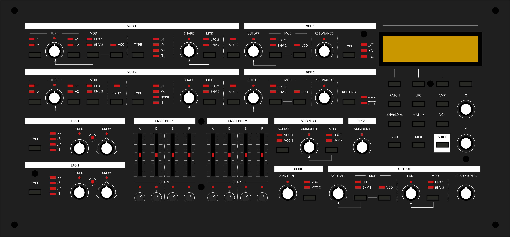

# 8 VOICE ANALOG SYNTHESIZER
</a>

## Features
- 8 voices
    * 2 envelopes
    * 2 LFO's
    * Highpass filter
    * Bandpass filter
    * 2 pole lowpass filter
    * 4 pole lowpass filter
    * 2 VCO's
    * VCO sync
    * Filter & VCO FM
    * AM
    * Pan
    * Overdrive
    * Wavefolder per VCO
- Digital recall of all parameters
- Modulation matrix

## Specs
- Cortex-M4 ARM 168mHz (STM32F4)
- 16 bit DAC
- 9/12V DC power

## Code structure
- `/Drivers`			Hardware peripheral drivers
- `/LookUpTables`	Tables & table generation
- `/Stm32`				MCU config
- `/Src/Settings`	All the synth data
- `/Src/Ui`				User interface to manipulate & visualize the data
- `/Src/Engine`		Responsible for running the data & talk to the hardware drivers

## Credits
- Pichenettes		https://github.com/pichenettes
- Ha Thach 			https://docs.tinyusb.org/en/latest/
- Moritz klein  https://github.com/moritzklein89
- Befaco    https://github.com/Befaco

## License

This work is licensed under a [MIT License](https://opensource.org/licenses/MIT).
